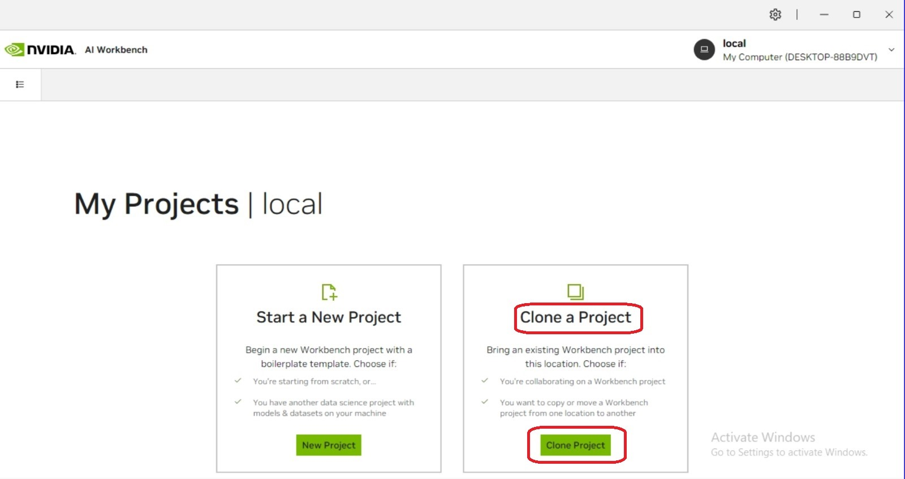
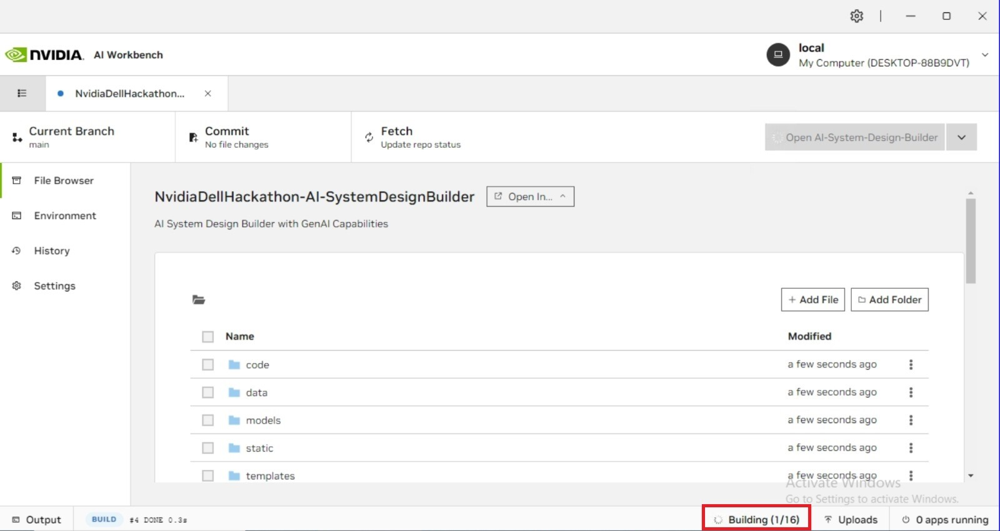
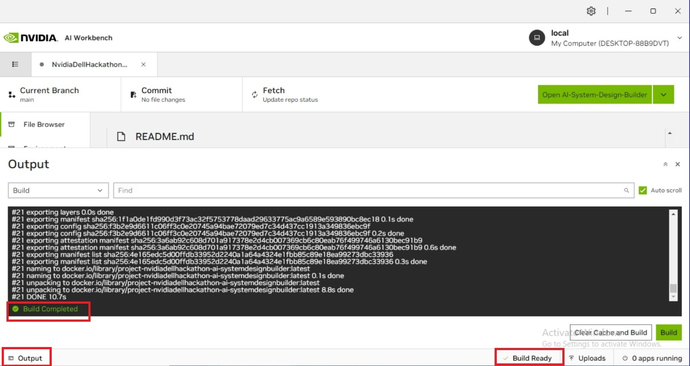
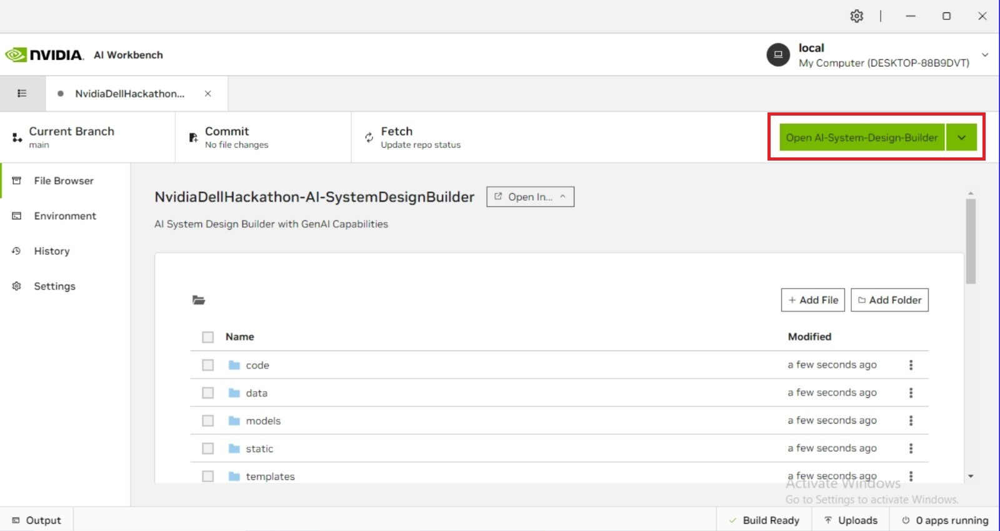
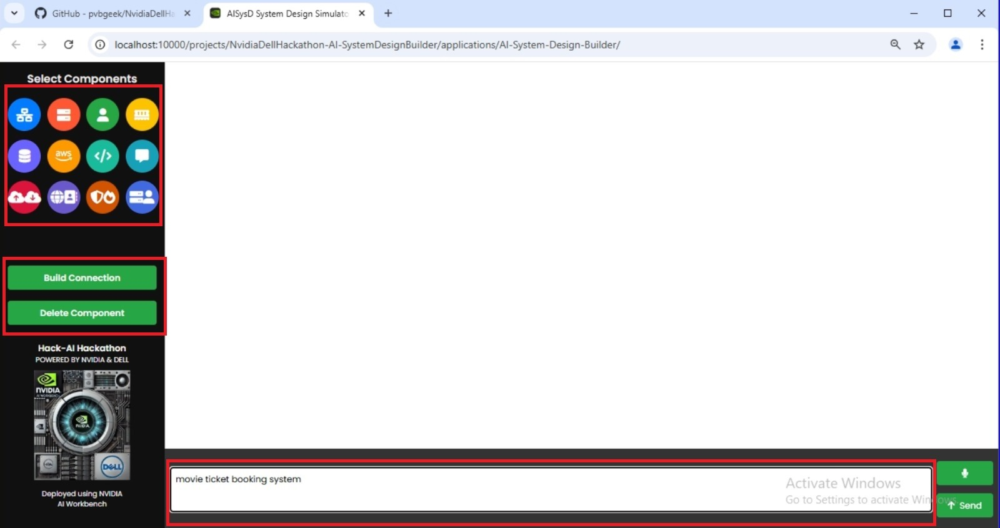
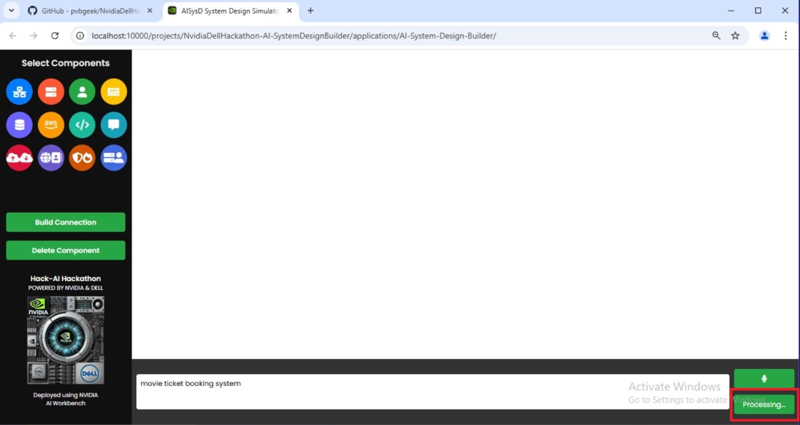

# AI-Based System Design Builder

This project provides an interactive platform for building and simulating system designs using AI. Powered by NVIDIA AI Workbench, it leverages advanced AI capabilities to generate optimized, scalable system architectures. 

Blogpost [Click here](https://atharva-weginwar.github.io/devpost.html)

YouTube [Click here](https://www.youtube.com/watch?v=taDNjlxNME4&t=1s)

Devpost [Click here](https://devpost.com/software/ai-based-system-design-simulator)

## Prerequisites

Before running this project, make sure you have the following installed:

- **NVIDIA AI Workbench**: [Installation guide](https://docs.nvidia.com/ai-workbench/user-guide/latest/installation/overview.html)
- **Python 3.8+**
- **CUDA Toolkit** (for GPU acceleration)
- **Docker** (for containerized environments)

## Installation and Using Steps

1. **Set Up NVIDIA AI Workbench**:
    - Follow the [Installation guide](https://docs.nvidia.com/ai-workbench/user-guide/latest/installation/overview.html) to set up the Workbench on your local machine or cloud environment.
    
    
   
2. **Select Clone Project Option**

    - Use this repository to clone https://github.com/pvbgeek/NvidiaDellHackathon-AI-SystemDesignBuilder
      

3. When you clone the project, The project will first appear in your main window with a "BUILD REQUIRED" status. Shortly after, the status will automatically change to "BUILDING" as the 
   system begins the build process.
   
    .jpeg)
    .jpeg)

4. After clicking on the project, it will enter the building stage. Please be patient, as the build process may take between 2 to 5 minutes to complete.
   
     

5. By selecting the output tab at the bottom left of the window, you can monitor the building process in real-time. Once the build finishes successfully, you'll see "build completed" in 
   the output, and the status will change to "build ready" in the bottom right corner.
   
     
   

6. After the build process completes, a green button labeled "Open AI-System Design Builder" will appear at the top of the window. Click this button to launch the application.
   
     
     
7. After launching the application, the Terminal window under the "Application" category will display the output log. Simultaneously, a new browser tab will automatically open, showing 
   your application running on localhost - indicating successful deployment.
   
     .jpeg)
     .jpeg)
      
8. You can create graphs in two ways:
   
   - Using the left panel: Drag and drop components, then use the build and delete connection methods to link them
   - Using the chat interface: Click the microphone button to give voice commands, then press the send button to execute them
     
     
     
9. After submitting your query, a processing message will appear. The design generation time varies between 30-45 seconds, depending on how complex your request is.
    
     
      
10. The design has been completed and is now ready to use. You can freely customize and modify it according to your needs.
    
      
